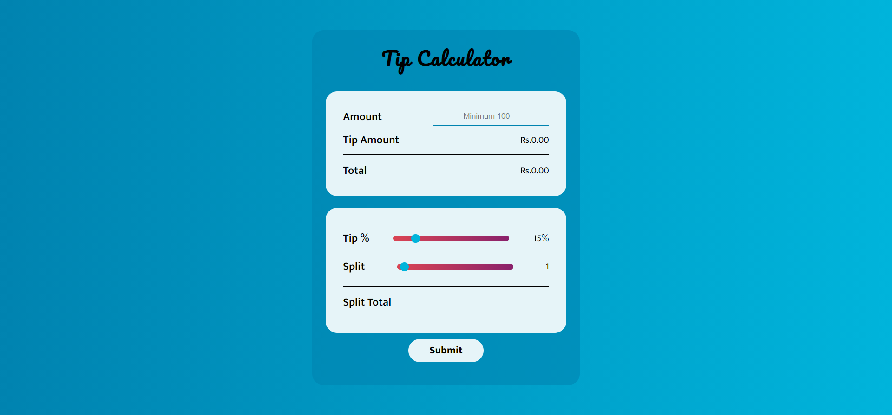
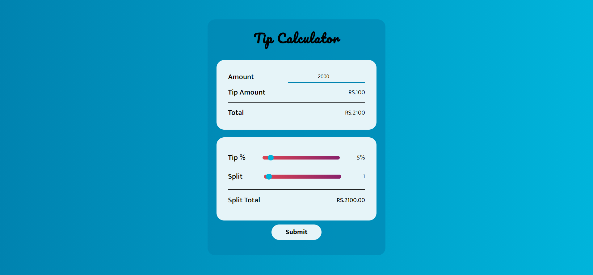

# Tip Calculator :thumbsup:

---

#### Project Idea:

A Tip Calculator App which helps the users to calculate the tip at different percentages.

This App also helps the users to split their amounts for a max of 50 people.

- [x] - **oninput**, Conversion of **String** to **Number**, Round of to 2 digits using **toFixed**
- [x] - HTML, CSS, vanilla JS.
- [x] - Well designed UI.

---

