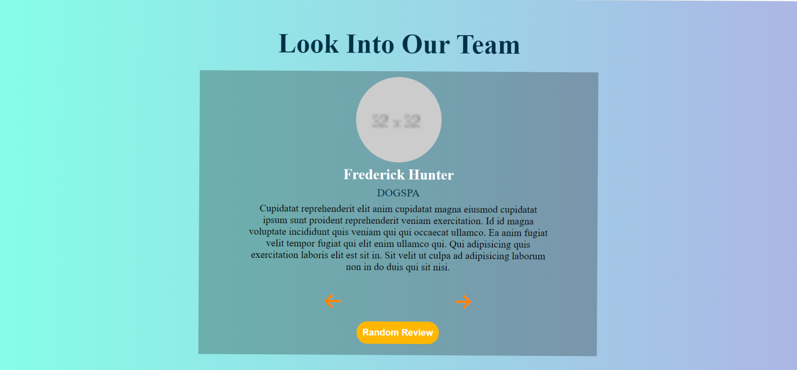

# Review Box :thumbsup:

---

#### Project Idea:

[Freecodcamp](https://www.freecodecamp.org/news/javascript-projects-for-beginners/#how-to-create-a-review-carousel)

Review Box is a review carousel which made using _HTML, CSS, JS_ . This Project helps to move forward, backward and get a random review from 200 Datasets which is made of Json Object.
Suggestions always welcome.

---

